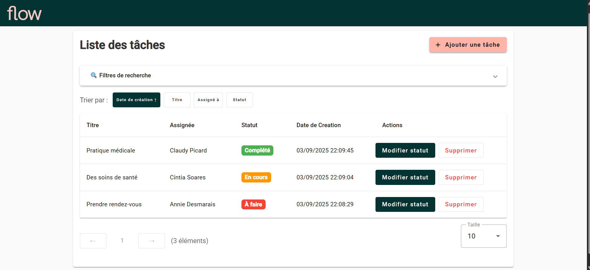

# ⚙️ Flow Tasks API (Backend)

Backend de l’application **Flow Tasks** — une API REST construite avec **.NET 8** et **Entity Framework Core**, suivant une architecture **Domain / Application / Infrastructure / API**.

---

## 🚀 Fonctionnalités
- ✅ CRUD complet sur les tâches (*ajout, liste, mise à jour, suppression logique*)  
- ✅ Pagination, tri et recherche avancée  
- ✅ Mise à jour du statut avec gestion de la concurrence optimiste (RowVersion)  
- ✅ Suppression douce (soft delete)  
- ✅ Gestion des utilisateurs pour assigner les tâches  
- ✅ Support **CORS** pour le frontend Angular  
- ✅ Migrations Entity Framework Core  

---

## 🛠️ Stack Technique
- **Framework** : .NET 8 Web API  
- **ORM** : Entity Framework Core  
- **Base de données** : SQL Server (par défaut, peut être adapté)  
- **Architecture** :
  - `Domain` → Entités + enums  
  - `Application` → Services métier  
  - `Infrastructure` → EF Core + Repository  
  - `API` → Endpoints minimal API  

---

## ▶️ Lancer l’API en local

### Prérequis
- [.NET 8 SDK](https://dotnet.microsoft.com/download)  
- [SQL Server](https://www.microsoft.com/sql-server/) ou [SQL Server LocalDB]  

### Étapes
# Aller dans le projet API
cd Flow.Tasks.Api

### 📦 Migrations automatiques (crée la base si elle n’existe pas)
L’API peut appliquer automatiquement les migrations au démarrage

### Lancer l’API
dotnet run
➡️ L’API est disponible sur : https://localhost:7121
➡️ Swagger UI : https://localhost:7121/swagger

### 📂 Principaux Endpoints
- Tâches (/tasks)
- GET /tasks → Liste paginée avec paramètres :
- page, pageSize, sortBy, desc, search, assignedTo, status

- POST /tasks → Créer une nouvelle tâche

- PATCH /tasks/{id}/status → Mettre à jour le statut d’une tâche

- DELETE /tasks/{id} → Suppression logique

- Utilisateurs (/users)
- GET /users → Récupérer la liste des utilisateurs disponibles pour l’assignation

### 🔗 Dépôts associés
Frontend Angular – flow-tasks-web https://github.com/SOUFIANECHAFIKDEV/flow-tasks-web/
